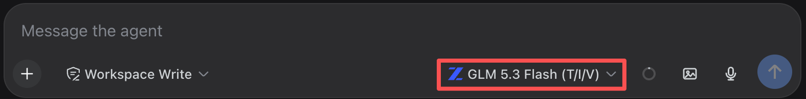
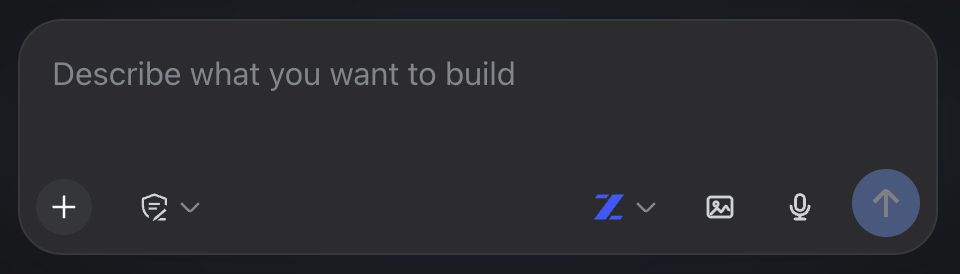

# DSH | dsh-plugin-model-icons | Per-provider brand icons on the composer's model button

Small composer polish: the model-select button shows a real brand icon for the active provider instead of plain text, and collapses to icon-only when the composer row gets narrow — the same responsive mechanism DSH's own built-in access-mode button already uses, applied consistently to the model button too.

## What it looks like



On a narrow composer row (a phone, or a resized desktop window), the trigger collapses to icon-only instead of pushing the row to wrap:



## Provider coverage

Detection works off the visible model name text (e.g. "GLM 5.3 Flash", "gpt-4o", "claude-3.5-sonnet") rather than an internal provider id — DSH's own model catalog wire type doesn't expose one to the client, so the name is the only signal available. Currently recognized out of the box: OpenAI, Anthropic, Google (Gemini), DeepSeek, Zhipu/GLM, xAI/Grok, Meta/Llama, Mistral, Qwen, Moonshot/Kimi, Cohere.

**A model from an unrecognized provider, or a newly released one that doesn't match an existing pattern yet, still works correctly** - it gets a plain generic icon (a small sparkle glyph) instead of a brand mark, never a blank space or a broken render. Nothing needs updating for the plugin to keep working as new models show up; only the brand-specific icon needs a new entry to appear (a name pattern + an SVG path, added to the `PROVIDERS` array in `src/client.js`) once a provider you care about isn't covered yet.

## How it integrates with DSH

A pure client-side patch (`src/client.js`, no build step) - it doesn't add any host-side behavior, just visual composer polish layered on top of DSH's existing model-select seat.

## Install

```sh
dsh plugin --profile web add @gz2016/dsh-plugin-model-icons
```

No configuration - it works out of the box for any provider already in your model catalog.

---
*Unofficial project, independently developed and maintained by a community member. Not affiliated with or endorsed by DeepSeek.*
